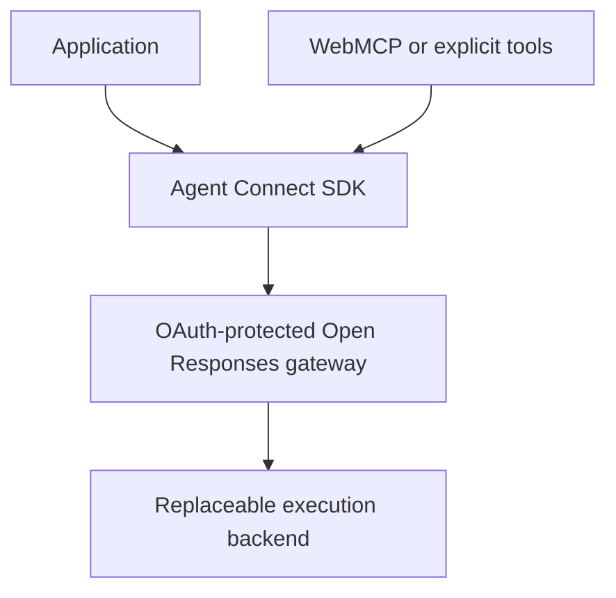

# Agent Connect: Open Responses and WebMCP conclusions

**Date:** 2026-08-27

**Purpose:** Handoff to the Codex instance revising ADR 0010 and resolving the
Ousterhout design review

**Resolution:** Incorporated into
[ADR 0010](../decisions/0010-open-responses-gateway-pivot.md). This file
preserves the research handoff, not the current decision.

**Related documents:**

- docs/decisions/0010-open-responses-gateway-pivot.md
- docs/reviews/2026-08-26-ousterhout-open-responses-design-review.md

## Executive conclusion

Proceed with Open Responses as the public application-facing wire protocol for Agent Connect.

This is not merely an attempt to reuse an adjacent model API. It is a direct expression of the original Agent Connect product idea: applications should be able to offer AI features while users supply access to intelligence they already subscribe to, without every application paying for inference or forcing users through bring-your-own-API-key setup.

Today, consumer AI subscriptions and provider API billing are separate. Coding harnesses such as Codex and Claude Code provide a practical bridge because they can authenticate through a user subscription and expose the resulting intelligence. They should be treated as replaceable execution backends, not as the application-facing abstraction.

Open Responses is the right boundary because it closely resembles the interface providers could expose if they eventually allowed OAuth-delegated API use backed by consumer subscriptions. If such a direct provider interface becomes available later, Agent Connect should be able to add it as another backend without requiring applications to change their integration.

WebMCP is complementary rather than competing. It can replace or augment the browser SDK's custom tool-definition mechanism. It should not replace the Agent Connect transport, authorization, response lifecycle, or durability model.

## Product thesis

Agent Connect is best described as a **user-owned, subscription-backed inference gateway**.

An application integrates once with an OAuth-protected Open Responses endpoint. The user authorizes the application to consume an AI runtime the user controls. Behind that endpoint, Agent Connect may run a coding harness, a local agent, a provider-specific adapter, or eventually a direct subscription-backed provider API.

The application should not need to know whether the response was produced by:

- Codex;
- Claude Code;
- another harness;
- a configured local or hosted agent;
- one foundation-model call or several;
- a primary agent plus subagents; or
- a future direct provider endpoint using delegated subscription access.

Those are execution details behind a stable public contract.

## Why Open Responses fits

The earlier concern was valid: Open Responses is framed as a model-response API, while Agent Connect executes an agentic stream that may emit text, call one or more application functions, resume after results, and internally use multiple models or subagents.

The deciding point is that the public contract still has the shape of a response:

- accept input;
- stream text and structured output;
- request function calls;
- accept function results;
- continue from prior response state;
- support cancellation; and
- report standard failures.

Applications benefit from seeing this familiar interface. They do not benefit from learning the private process model of the harness.

Therefore:

> Open Responses is Agent Connect's public wire format, not necessarily its internal ontology.

Agent Connect may preserve a richer internal run model for process ownership, durable work, response chaining, tool-call recovery, and harness sessions.

## Meaning of the model field

The model field is the clearest semantic mismatch, so ADR 0010 must define it honestly.

For Agent Connect, model identifies a **logical execution profile or routing target**, not necessarily the single physical foundation model responsible for every token and tool decision.

For the first version, expose only:

- agent-connect/default

The gateway should echo that same logical identifier in responses. Its documentation should state that this profile may:

- select a configured provider model;
- make multiple model calls;
- use runtime-owned tools;
- delegate work to subagents; or
- change its internal implementation over time while preserving the profile's contract.

Do not expose arbitrary model selection in the first profile. Later, Agent Connect could deliberately introduce profiles such as agent-connect/fast or agent-connect/deep, or concrete backend targets where useful. Those should be product-level execution promises, not accidental leakage of backend configuration.

## Multiple models and subagents

Open Responses does not need to represent every internal model call or subagent message in the root response.

The gateway should project the root agent's externally meaningful behavior into standard response items and events:

- user-visible text;
- application function calls;
- application function results;
- final completion;
- cancellation; and
- errors.

Internal delegation should remain private by default. If detailed provenance or a live agent tree later becomes a product requirement, expose it through optional tracing or an extension rather than corrupting the basic Open Responses semantics. AG-UI may remain a possible richer UI adapter, but it is not required for the core wire.

## Public responses versus internal runs

A logical Agent Connect run and an Open Responses response are related but not identical.

One logical run may span a chain of responses:

1. The application creates a response.
2. The gateway streams text and one or more function calls.
3. The application executes those calls and submits their outputs.
4. A subsequent response continues using previous_response_id.
5. The cycle repeats until no unresolved application calls remain.

Consequently, response.completed means that one response-generation segment has completed. The higher-level SDK run method may remain active while application function calls are outstanding and may create or continue another response after receiving their results.

Keep the internal durable run abstraction where it provides:

- ownership of the harness process or session;
- mapping of a response chain to one logical task;
- persistent application calls before publication;
- stable call identifiers;
- idempotent result submission;
- redelivery and recovery;
- cancellation propagation; and
- authorization and revocation checks.

This avoids forcing a distributed workflow into an in-memory HTTP request while still presenting a standard protocol at the boundary.

## Bounded Open Responses profile for version 0

Claim compatibility only for a documented, testable subset.

### Support

- POST /v1/responses
- HTTP with SSE streaming
- text input and output
- application-defined function tools
- sequential function calls
- previous_response_id continuation
- persisted response state
- cancellation
- a stable, documented error taxonomy

### Reject or defer explicitly

- WebSocket transport
- store: false
- parallel function calls
- background mode
- arbitrary provider model routing
- hosted provider tools
- service tiers
- arbitrary extension payloads

Unsupported fields and combinations should fail clearly rather than being ignored. Compatibility should be demonstrated with standard Open Responses clients and conformance tests, supplemented by Agent Connect tests for durability, OAuth, and recovery.

## WebMCP's role

WebMCP standardizes how a web page publishes tools and handlers to an agent-capable browser. In Agent Connect, that makes it a natural source of **application-owned tools**.

The browser SDK should introduce an internal ApplicationToolSource abstraction with two operations:

- snapshot: return the tool definitions for a logical run;
- execute: invoke a snapshotted tool by stable handle.

Initial implementations should include:

- ExplicitToolSource for the current defineTool-style API;
- WebMcpToolSource backed by document.modelContext; and
- a deterministic fake source for tests.

The WebMCP adapter should:

1. Discover tools through document.modelContext.getTools().
2. Map each WebMCP inputSchema to the Open Responses function parameters schema.
3. Register a stable internal handle for the implementation.
4. Invoke the tool through executeTool().
5. Convert the result deterministically into function-call output.

The gateway must not know that a tool came from WebMCP. It should only see standard Open Responses function definitions and results.

Keep explicit tool registration as a fallback while WebMCP matures and for environments that do not implement it.

### Tool stability

Freeze the application tool snapshot for the entire logical run or response chain. Apply WebMCP toolchange events only to the next run.

If a snapshotted tool disappears before invocation, fail that call explicitly. Do not silently route it to a different tool with the same name.

For version 0, prefer top-level page tools only and define deterministic behavior for name collisions and origin boundaries.

## Two distinct tool planes

Preserve the architectural distinction between:

1. **Runtime-owned tools:** shell, filesystem, repository, search, or other capabilities available inside the user-owned harness.
2. **Application-owned tools:** browser or application functions supplied with the response, potentially discovered through WebMCP.

Both may appear in one agentic execution, but they have different trust boundaries, execution locations, failure modes, and authorization rules. ACP, MCP, or harness-native mechanisms may be used behind the gateway for runtime-owned tools; they are implementation details rather than the browser contract.

## Authorization implications

The design needs two separate grants:

1. **Gateway grant:** the application may consume the user's Agent Connect runtime and underlying subscription-backed intelligence.
2. **Page-tool authority:** the current browser context may expose and execute a particular set of application tools.

This separation matters once WebMCP makes the tool set dynamic. A long-lived OAuth grant tied to an exact hash of page tool definitions is likely too brittle. The durable grant should primarily authorize the application to use the user's runtime. The browser should mediate the current page's tool authority, freeze a per-run snapshot, and use stable call identifiers. Consequential calls may additionally use browser confirmation mechanisms.

Keep these concepts separate in the ADR:

- gateway identity;
- owner authentication;
- application grant policy;
- OAuth protocol mechanics; and
- per-page tool authority.

## Target architecture

The backend can initially be a bundled coding harness. Later it can be replaced or supplemented by another harness or a direct delegated provider endpoint. The application-facing integration remains unchanged.

## Required revisions to ADR 0010

Revise ADR 0010 so it:

1. States subscription portability as the central product rationale.
2. Defines Agent Connect as an OAuth-protected, user-owned, subscription-backed Open Responses endpoint.
3. Treats coding harnesses as replaceable backends rather than the public protocol.
4. Defines model as a logical execution profile and initially exposes only agent-connect/default.
5. Specifies the bounded version 0 compatibility profile.
6. Distinguishes Open Responses as the public wire from the internal durable run model.
7. Explains how one logical run may span a previous_response_id chain.
8. Preserves the separation between runtime-owned and application-owned tools.
9. Adds WebMCP as an optional browser-side ApplicationToolSource, not a gateway protocol.
10. Reassesses exact tool-hash grants in light of dynamic WebMCP tools.
11. Keeps AG-UI optional and ACP or MCP behind the gateway as implementation details.
12. Keeps the existing Omnigent path as a temporary baseline until the replacement vertical slice proves the new design.
13. Defines the deletion point: remove the custom task/event protocol and browser-visible Omnigent path after the compatibility, authorization, and durability gates pass.

ADR 0010 should remain proposed until the proof gates below pass. Once accepted, it should become the source of truth; the research review should be marked resolved or amended with links to the ADR decisions rather than becoming a competing architecture document.

## Proof gates

The pivot is ready to accept when all of these are demonstrated:

- A standard Open Responses client completes a real task involving multiple sequential application function calls.
- The logical model identifier is stable and documented honestly.
- One logical run spans a response chain without losing harness continuity.
- Each application call is persisted before it is published.
- Call identifiers survive reconnects, redelivery, and duplicate result submission.
- Cancellation propagates through response, run, and harness layers.
- The WebMCP adapter can snapshot and execute page tools without gateway-specific knowledge.
- The gateway grant and page-tool authority are documented as separate concerns.
- Common application flows require no Agent Connect-specific response payloads.
- Unsupported Open Responses features fail explicitly.
- The legacy browser protocol is deleted after migration rather than maintained indefinitely.

## What this decision does not claim

This decision does not claim that:

- a ChatGPT, Claude, or Gemini subscription is currently equivalent to general provider API credit;
- every harness supports identical capabilities;
- Open Responses describes Agent Connect's entire internal execution graph;
- internal subagents must be surfaced to applications;
- WebMCP solves remote inference, OAuth grants, durability, or recovery; or
- Agent Connect should advertise full Open Responses compatibility before passing conformance tests.

## Direction to the receiving Codex

Use this document to resolve the findings in the Ousterhout design review.

Do not paste it wholesale into the review. Instead:

1. Map each relevant review finding to a concrete ADR 0010 change, an implementation gate, or an explicit non-goal.
2. Revise ADR 0010 as the authoritative decision document.
3. Update the Ousterhout review with a concise resolution status and links to the corresponding ADR sections, or create the repository's normal resolution record if reviews are immutable.
4. Preserve unresolved objections when the ADR still lacks a concrete answer; do not mark them resolved merely because the direction is promising.
5. Update broader mission or architecture documents only after the ADR wording is internally consistent.
6. Avoid preserving two public protocols indefinitely. The intended end state is Open Responses at the application boundary, with WebMCP or explicit definitions feeding application tools into that protocol.

## References

- [Open Responses specification](https://www.openresponses.org/specification)
- [Open Responses reference](https://www.openresponses.org/reference)
- [Open Responses compatibility and acceptance](https://www.openresponses.org/compliance)
- [OpenAI authentication options for Codex](https://learn.chatgpt.com/docs/auth)
- [OpenAI API production and authentication guidance](https://developers.openai.com/api/docs/guides/production-best-practices)
- [OpenAI Responses multi-agent guidance](https://developers.openai.com/api/docs/guides/responses-multi-agent)
- [OpenAI WebMCP documentation](https://learn.chatgpt.com/docs/webmcp)
- [WebMCP proposal](https://webmachinelearning.github.io/webmcp/docs/proposal.html)
